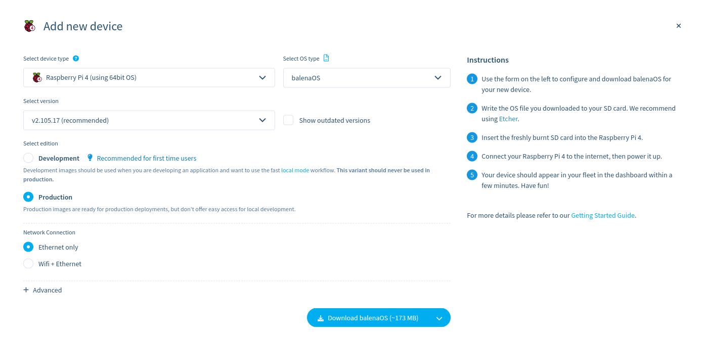

# nextcloud-balena

Installation de nextcloud sur un balena cloud

## Le materiel

1) [Acheter un raspberry pi 4](https://www.amazon.fr/Vemico-Raspberry-Adaptateur-Ventilateur-Dissipateur/dp/B09GFHYXG9/ref=sr_1_3?__mk_fr_FR=%C3%85M%C3%85%C5%BD%C3%95%C3%91&crid=2GXP531Z0N3W4&keywords=pi4&qid=1666616230&qu=eyJxc2MiOiI1LjAyIiwicXNhIjoiNC4wNyIsInFzcCI6IjIuNzYifQ%3D%3D&sprefix=pi%2Caps%2C103&sr=8-3)
2) [Acheter une carte SD](https://www.amazon.fr/SANDISK-Adaptateur-Logiciel-R%C3%A9cup%C3%A9ration-RescuePRO/dp/B06XWMQ81P/ref=sr_1_8?__mk_fr_FR=%C3%85M%C3%85%C5%BD%C3%95%C3%91&crid=KBOVVSPKZFK2&keywords=sandisk+32go&qid=1666617286&qu=eyJxc2MiOiI0LjE1IiwicXNhIjoiMy45NyIsInFzcCI6IjMuNjEifQ%3D%3D&sprefix=sandisk+32go%2Caps%2C103&sr=8-8)

## Prérequis

1) [Créer un compte sur balena cloud](https://dashboard.balena-cloud.com/login)
2) [Créer une organisation](https://www.balena.io/docs/learn/manage/organizations/#creating-a-new-organization) 
3) [Créer une flotte](https://www.balena.io/docs/learn/manage/organizations/#creating-new-fleets-under-your-organization) 
4) Créer un nouveau device depuis votre flotte: 
  
5) [Installer balena etcher et flasher votre carte sd en choisissant l'OS que vous venez de télécharger](https://www.balena.io/etcher/)
6) Alimenter votre raspberry et brancher le à une prise ethernet, pour le configurer en wifi modifier le fichier ```resinbot/system-connections/balenaWifi01``` de sorte à avoir 
```bash
[connection]
id=balena-wifi
type=wifi

[wifi]
hidden=true
mode=infrastructure
ssid= votre ssid

[ipv4]
method=auto

[ipv6]
addr-gen-mode=stable-privacy
method=auto

[wifi-security]
auth-alg=open
key-mgmt= votre type de sécurité de clé(exemple : wpa-psk)
psk= le mot de passe du réseau wifi
```
:100:	Félicitation votre nouvelle machine apparait par magie sur votre flotte :100:	

6) [Installer balena CLI sur votre environnement de développement](https://github.com/balena-io/balena-cli/blob/master/INSTALL.md) :warning:	__vous allez en avoir besoin__ :warning:


## Installation

1) cloner le dépôt :```git clone https://github.com/klutchell/balena-nextcloud```
2) déplacer vous dans le dossier : ```cd balena-nextcloud```
3) Identifier vous avec balena en ligne de commade : ```balena login``` choisir ```Web authorization```
4) Vous pouvez avec cette commande voir votre machine que vous venez de créer, récupérer l'uuid :```balena devices --fleet votre_flotte```
5) Avec balena cli connecté vous à votre device avec l'uuid que vous avec récupérer : ``` balena ssh <uuid>```
6) Une fois connecté, Afficher le contenue de config.txt ```cat /mnt/boot/config.txt```
7) Vérifier que vous avez:
```bash
gpu_mem_1024=448
gpu_mem_256=192
gpu_mem_512=256
start_x=1
avoid_warnings=1
disable_splash=1
dtoverlay=vc4-kms-v3d
dtparam=i2c_arm=on
dtparam=spi=on
dtparam=audio=on
gpu_mem=16

```
Si ce n'est pas le cas, [veuillez suivre ces étapes](https://www.balena.io/docs/learn/manage/configuration/).
8) créer un fichier ```/registry-secrets.yml``` contenant vos crédential balena de la sorte
```bash
'':
     username: votre_username
     password: votre_mot_de_passe
```
10) Pour déployer vers balena cloud : ``` balena deploy votre_slug/votre_flotte --registry-secrets ./registry-secrets.yml --release-tag="votre_tag"```
11) À la fin de votre déploiement, une nouvelle release va apparaitre dans votre flotte, dans les paramètre de votre device changer la release du device, pour qu'elle pointe vers la nouvelle release
